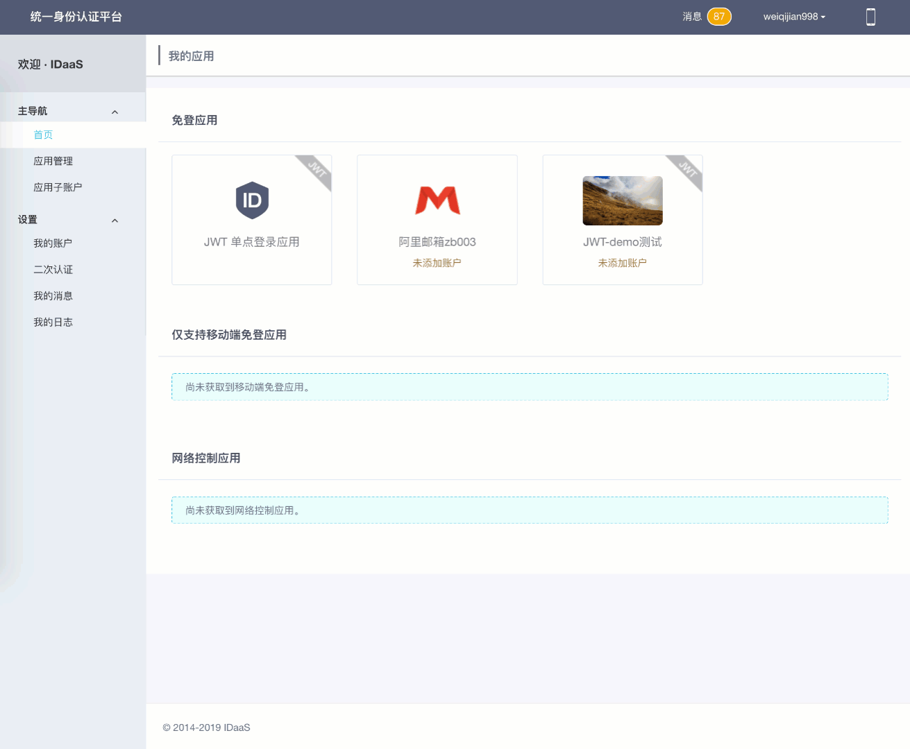
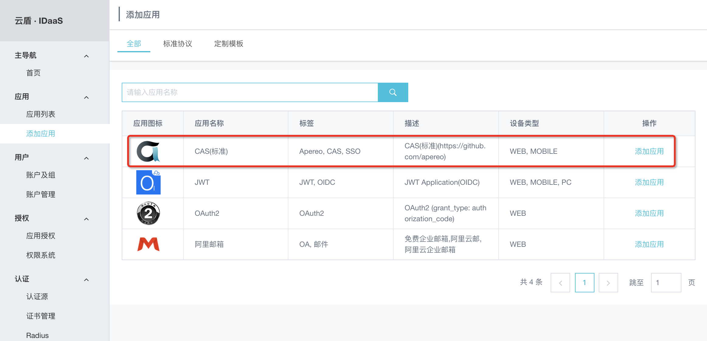
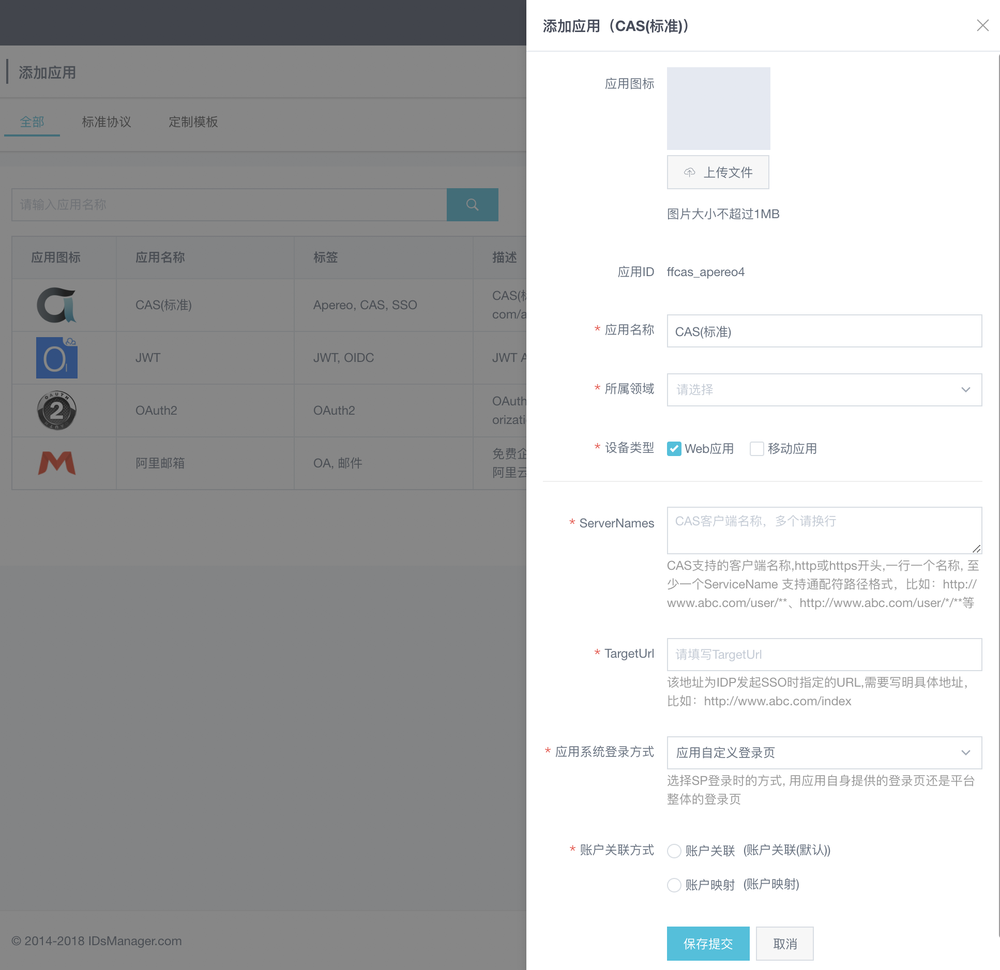
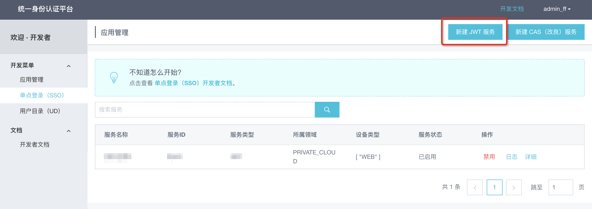
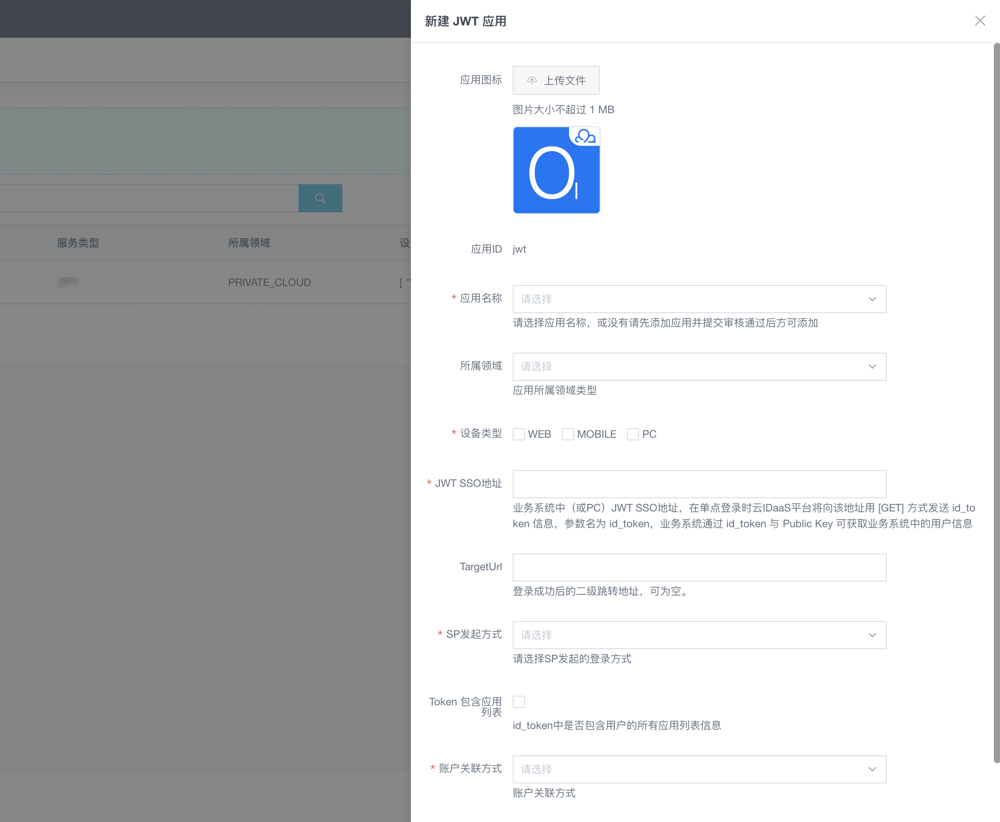
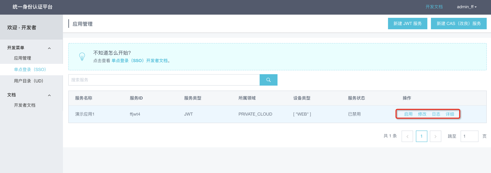
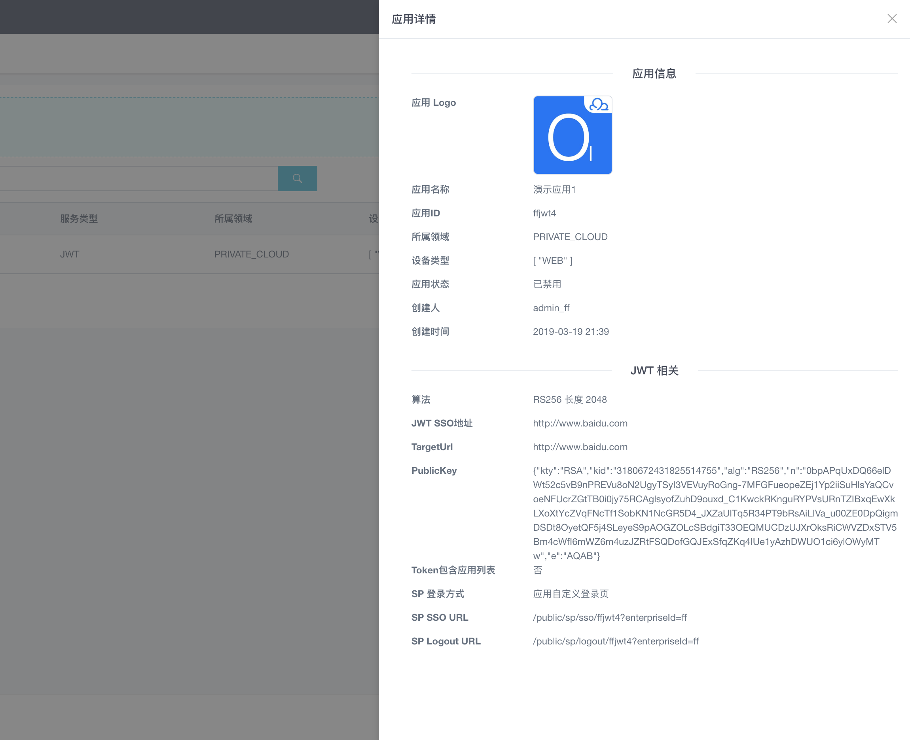

# 单点登录SSO
## 单点登录（SSO）概述
　　单点登录（SSO），英文全称为 Single Sign On。 SSO 是指在多个应用系统中，用户只需要登录一次，就可以访问所有相互信任的应用系统。IDaaS SSO 服务用于解决同一公司不同业务应用之间的身份认证问题，只需要登录一次，即可访问所有添加的应用。此服务可以涵盖用户在公有云和私有云中的双重需求。 
　　本文档默认你已经拥有了开发者权限，并已经阅读了 准备开发 文档 和 应用管理 文档。如果需要分配新的开发者权限的话，请联系 IT 管理员进行授权操作。

登录 IDaaS -> 单点登录示例

## 单点登录场景
在单点登录实现过程中，现已满足以下登录场景，包括：
1. IDP 发起
2. SP 发起
3. 接口后置
4. 登录跳转
### IDP 发起
即 IDaaS 发起。用户登录 IDaaS 平台，从 IDaaS 登录到 `SP` 应用场景，如下图所示：

IDaaS 发起单点登录流程

（1）用户访问 IDaaS 登录页面输入用户名和密码进行登录

（2）浏览器携带用户名密码向 IDaaS 请求登录

（3）IDaaS 认证通过后，创建主 session ，并返回应用列表给浏览器

（4）IDaaS 登录成功，用户可以看到 IDaaS 展示的应用列表

（5）用户点击应用列表中的 SP1 应用图标

（6）浏览器携带 SP1 应用的应用 id，向 IDaaS 请求生成 SP1 应用子 token

（7）IDaaS 根据信息生成子 token 并返回给浏览器

（8）浏览器携带子 token ，向 SP1 请求登录

（9）SP 1 应用系统解析获取的子 token ，验证通过后，创建子 session 并返回登录后页面

（10）SP 1 系统单点登录成功，浏览器显示 SP1 系统登录后页面

（11）\~（16）表示 SP2 系统的单点登录流程，与 SP1 系统步骤一致，即在主 session 创建后，任何一个可单点登录应用进行单点登录的流程只需重复（5）\~（10）即可

### SP 发起
SP 发起主要应用于 SSO 后可以跳回发起 SSO 的应用页面。下面以 SAML 和 JWT 的实现为例来阐述 SP 发起的单点登录流程。

#### 1、访问应用页面
用户到 SP 应用页面，会在 SP 通过 Redirect 或 POST 提交一个某种认证协议如 SAML / CAS 的挑战请求， 在 IDaaS 登录后， 再跳转回 SP 作为应答， 实现统一认证，如下图所示：

SP 发起单点登录流程
 

以 SAML 协议 SP 发起的单点登录为例：

（1）用户访问 SP 资源页面

（2）浏览器向 SP 请求资源

（3）SP 生成 SAML AuthnRequest 请求，其中包含当前 URL 到 RelayState，并返回给浏览器

（4）浏览器携带 SAML AuthnRequest 请求，访问定义好的 IDaaS 中 SP 发起的 SSO URL

（5）IDaaS 验证 SAML AuthnRequest，若该用户已登录直接跳至步骤（9），否则继续步骤（6）

（6）重定向到 IDaaS 登录页面

（7）用户输入 IDaaS 的账户和密码

（8）浏览器携带账号密码请求登录 IDaaS

（9）登录 IDaaS 后， IDaaS 分析 SAML AuthnRequest 中的 SP 应用信息，并获取更多用户信息，然后组合生成响应包含 RelayState 的 SAML Response Token。

（10）返回 SAML Response Token 数据给浏览器

（11）浏览器进行跳转，携带 SAML Response Token，访问 SP ACS URL

（12）SP 利用公钥验证 SAML Response Token

（13）校验成功后，创建 session 会话，从 RelayState 中取出开始时发起的 URL，返回给浏览器

（14）浏览器访问资源页面

（15）SP 返回资源页面

（16）用户登录进 SP 资源页面

#### 2、访问 SP 资源
用户访问 SP 资源，SP 会重定向到 IDaaS 的 SSO 地址，在 IDaaS 认证通过后，会向 SP 返回 SP 发起登录的页面并携带请求事件redirect_url参数，用户登录后 SP会向浏览器返回并显示用户访问的资源页面，如下图所示：

SP 发起单点登录流程-deeplinking

以 JWT 协议 SP 发起的单点登录为例：

（1）用户访问 SP 资源页面

（2）浏览器向 SP 请求资源

（3）SP 检测登录，若该用户已登录直接跳至步骤（9），未登录继续到（4）

（4）SP 把当前页面地址置入 redirect_url 参数，并重定向到 SP SSO URL

（5）重定向到 IDaaS 登录页面

（6）用户输入 IDaaS 的账户和密码进行登录

（7）浏览器携带账号密码请求登录 IDaaS

（8）IDaaS 对账户进行认证并通过

（9）返回 JWT SSO URL，在 URL 中包含了 id_token 和 target_url

（10）浏览器携带上述参数跳转到 redirect_url

（11）SP 通过 PublicKey 对 id_token 进行校验

（12）校验成功后，创建 session 会话，向浏览器返回用户访问的 redirect_url 地址并进行跳转

（13）用户查看到之前访问的页面资源

### 接口后置
SP 登录时使用 IDaaS 进行接口后置认证登录场景，如下图所示：

接口后置单点登录流程
 

（1）用户访问 SP1 登录页面

（2）浏览器请求 SP1 登录页面

（3）SP 1 返回其登录页面

（4）用户看到 SP1 登录页面

（5）用户输入用户名密码进行登录

（6）浏览器携带用户名、密码向 SP1 发起登录请求

（7）SP 1 使用 IDaaS 接口进行认证，将用户名、密码传递给 IDaaS 进行认证登录

（8）IDaaS 进行认证后，生成主 token ，并返回主 token 和应用列表以及用户信息给 SP1

（9）登录 SP1 成功，浏览器获取到 SP1 登录后页面

（10）用户可看到 SP1 登录后页面，可看到显示的应用列表

（11）用户在 SP1 显示的应用列表中点击 SP2 应用图标进行单点登录

（12）浏览器携带主 token 和应用id，向 IDaaS 请求生成子 token

（13）IDaaS 返回 SP2 的子 token 以及 SP2 重定向地址

（14）浏览器携带子 token 访问 SP2 重定向地址

（15）SP2 解析子 token ，验证成功，并返回 SP2 登录后页面

（16）用户看到 SP2 登录后页面， SP2 应用系统登录成功

### 登录跳转
用户到 SP 应用页面，会跳转到 IDaaS 登录页面进行统一认证，登录后，返回一个包含更多用户信息 JWT token 到 SP 页面，包括应用列表和访问一个 SP 应用的子token，从而实现单点登录。如下图所示：
 

（1）用户访问 SP1 系统登录页面

（2）浏览器向 SP1 请求登录页面

（3）SP 1 返回重定向地址

（4）浏览器访问重定向地址

（5）IDaaS 返回登录页面

（6）浏览器携带用户提交的用户名密码以及应用id，向 IDaaS 请求登录

（7）IDaaS 本地认证成功后，创建主 session ，并返回应用列表的 JWT token 内含了子 token

（8）浏览器接收信息后，校验并解析出子 token ，向 SP1 请求认证登录

（9）SP 1 获取子 token 并解析后，创建子 session ，并返回登录后页面

（10）用户看到 SP1 登录后页面， SP1 登录成功

（11）用户在 SP1 已成功登录后，访问 SP2 登录页面

（12）浏览器向 SP2 请求登录页面

（13）SP2 返回重定向地址

（14）浏览器访问重定向地址

（15）IDaaS 由于主 session 已创建，可直接根据应用id生成 SP2 系统的子 token ，并返回子 token

（16）浏览器携带子 token ，向 SP2 发起请求

（17）SP2 解析子 token 后，创建子 session 并返回 SP2 登录后页面

（18）用户看到 SP2 登录后页面， SP2 登录成功

## 开发须知
### 开发者须知
`文档中的 “IDaaS-Base-URL” 需要替换为当前访问地址的主域，文中接口地址前也都需要替换主域地址；接口地址中的版本号以当前使用系统版本为准，也可以查看开发者文档中右侧菜单顶部的接口版本。`

用户通过登录 IDaaS 系统，能够在用户的主界面应用列表中看到自身有权限访问的应用列表。用户可以选择一个应用进行单点登录。

单点登录到第三方应用的过程，对于用户来说是透明过程。此过程无需用户填写第三方应用系统的账号信息，而是通过安全的协议交换令牌，直接验证身份进入应用系统。

公有云中的应用普遍支持 `OIDC` ， `OAuth` ， `SAML` 等标准协议。在私有云中，我们也提供了无插件式 SSO （如 CAS 标准和 CAS 改良）和插件式 SSO （如 JWT 标准协议）两种方式以方便企业内部应用向 IDaaS 的迁移。

业务应用集成到 IDaaS 后， IDaaS 会提供针对应用的一些接口，包括 账号关联，修改账户信息，解锁账户，删除账户等操作。针对用户或组织机构的操作接口，可以参考 [用户目录（UD）](开发指南/用户目录（UD）/用户目录（UD）同步概述.md) 文档。

已经支持语言：`PHP`，`JAVA`，`.NET`，`Python`。

### 无插件式 SSO 中的 CAS 标准和 CAS 改良
通过 CAS 方式进行集成时可以分为：CAS 标准 和 CAS 改良 两种。

使用 `CAS 标准` 时，首先是由 CAS Client 发起， CAS Client 会重定向到 CAS Server（由 IDaaS 充当）进行登录，由 CAS Server 进行账户校验且多个 CAS Client 之间可以共享登录的 session ，Server 和 Client 是一对多的关系；

使用 `CAS 改良` 时，首先是由 IDaaS 发起， IDaaS 发参数到 CAS Client ，CAS Client 自身校验了用户之后把用户信息返回给 IDaaS ， IDaaS 再次校验 Ticket 然后返回给 CAS Client ，在解析 Ticket 过程中一个 CAS Client 对应接收一个 applicationId，他们是一对一的关系；

当前暂不支持从开发者界面创建管理 CAS（改良）应用，请联系管理员添加 CAS（标准）应用对接使用。

## 无插件式 SSO （ CAS 标准）
### 原理和协议
从结构上看，CAS 包含两个部分： `CAS Server` 和 `CAS Client` 。 CAS Server 需要独立部署，主要负责对用户的认证工作； CAS Client 负责处理对客户端受保护资源的访问请求，需要登录时，重定向到 CAS Server。

下图是标准 CAS 最基本的协议过程：

无插件式 SSO ( CAS 标准)原理
 

CAS Client 与受保护的客户端应用部署在一起，以 `Filter` 方式保护受保护的资源。对于访问受保护资源的每个 Web 请求， CAS Client 会分析该请求的 Http 请求中是否包含 `Service Ticket` ，如果没有，则说明当前用户尚未登录，于是将请求重定向到指定好的 `CAS Server` 登录地址，并传递 Service （也就是要访问的目的资源地址），以便登录成功过后转回该地址。

用户在 上图流程中的 `第 3 步` 输入认证信息，如果登录成功， `CAS Server` 随机产生一个相当长度、唯一、不可伪造的 `Service Ticket` ，并缓存以待将来验证，之后系统自动重定向到 Service 所在地址，并为客户端浏览器设置一个 Ticket Granted Cookie（TGC）， `CAS Client` 在拿到 Service 和新产生的 `Ticket` 过后，在 `第 5，6 步` 中与 CAS Server 进行身份核实，以确保 Service Ticket 的合法性。

而在 IDaaS 中， 一个 CAS （标准）应用实现了标准的 CAS 流程。它充当一个 CAS Server的角色。当 CAS client 决定使用 CAS （标准）应用作为 CAS Server 时。在登录认证时需要使用 IDaaS 系统中公司的主账号，密码进行认证。

### IDaaS 中添加 CAS （标准）应用
`CAS 标准应用目前只能由 IT 管理员 在应用添加菜单中添加。下面是 IT 管理员的应用添加流程。如果希望使用 CAS（标准）单点登录，可以请管理员进行协助添加和配置。` 
1、以IT管理员身份登录 IDaaS ，点击添加应用,找到 CAS （标准），点击 添加应用

添加 CAS（标准）应用第 1 步
 

2、填写 `serverNames` ,即每一个 CAS Client 的名称，一行一个，如有多个换行添加即可，点击保存。

添加 CAS（标准）应用第 2 步
 

3、启动该应用，并查看该应用详情，这里可以对应用进行一系列操作。 client里面配置使用。

添加 CAS （标准）应用第 3 步
 

4、点开应用详情，主要注意 `CAS Login URL` 和 `CAS Server URL Prefix` 两个参数以便接下来在 CAS client里面配置使用。

添加 CAS （标准）应用第 4 步

### 在 CAS Client 中使用 CAS（标准）应用作为 CAS Server
在 CAS client 中配置刚刚添加的 CAS （标准）应用，找到 CAS Client 的 web.xml 文件，将以下参数配置为 CAS （标准）应用中的参数值。

1、修改 `CAS ServerLoginUrl` 为 CAS （标准）应用中的 `CAS Login Url` 
修改 CAS ServerLoginUrl

2、修改 `CAS ServerUrlPrefix` 为 CAS （标准）应用中的 `CAS Server URL Prefix` 
修改 CAS ServerUrlPrefix

3、其他的 CAS Client 应用请参照以上配置

## 无插件式 SSO （ CAS 改良）
`当前暂不支持从开发者界面创建管理 CAS（改良）应用，请联系管理员添加 CAS（标准）应用对接使用。`

### 简介
整个无插件 CAS （改良）的单点登录流程，就是需要开发者写一个页面接收 IDaaS 传过去的 url 参数，接着对 IDaaS 进行一次网络请求并验证返回值，成功则登录，失败则拒绝。开发人员可以自己按照这个逻辑完成代码，也可以在我们提供的代码 demo 的基础上进行修改。

### 实现原理

无插件式 SSO (CAS 改良) 原理
 

1. 通过浏览器登录集成的 IDaaS 系统后，确认要单点登录的应用，发起 SSO 请求到 IDaaS 系统。

2. IDaaS 生成 `ticket` （传过来的url参数为code）指针发送到业务应用。

3. 业务应用获取到 ticket 后通过回调方法到 IDaaS 校验 `ticket` 。

4. IDaaS 获取到 `ticket` 后进行校验，返回校验结果给业务应用。

5. 如果校验结果成功，返回用户信息，应用在校验返回信息成功后登录；如果校验结果失败，你的应用应该拒绝登录。

## 插件式 SSO
### 简介
整个插件式 JWT 的流程，是接收 IDaaS 平台向 callback url 发出的 id_token 参数（即 JWT 令牌），并使用我们提供的（或第三方提供的） JWT 解密库/方法对 JWT 进行解析，并验证身份。 你可以自己按照这个逻辑完成代码，也可以在我们提供的 代码/demo 的基础上进行修改。

### 实现原理

插件式 SSO - JWT 原理
 

1. 通过浏览器登录集成的 IDaaS 系统后，确认要单点登录的应用，发起 SSO 请求到 IDaaS 系统。

2. IDaaS 生成 `token` 令牌发送到业务应用。

3. 你的应用获取到 `token` 令牌，用我们提供的插件或方法解析 `token` 令牌，解析成功获取到用户信息并验证后，重定向进行登录；如果解析失败则拒绝登录。

### 申请 JWT 应用
`本章节默认你已经创建了应用。如果还未创建一个应用并审核的话，请前往创建应用。`

#### 第 1 步：应用审核通过后添加单点登录（SSO）服务，选择右侧的列表中选择单点登录（SSO），然后点击添加 JWT 单点登录。如下图：

申请 JWT 应用
 

#### 第 2 步：填写应用信息完成后保存。如下图：

填写 JWT 应用详情
 

参数说明:

1. 图标: 业务应用的 logo 图片。

2. 应用服务 ID: 自动生成服务 ID，且唯一。

3. 应用名称: 代表该业务应用的名称。

4. 所属领域: 代表区分该应用服务类型是哪一种服务类型。

5. 设备类型: 代表该服务支持的设备类型，标记使用。

6. JWT SSO 地址: 业务应用中的 JWT SSO 地址，在单点登录时 IDaaS 将向该地址用 GET 方式发送 id_token 信息，参数名为 id_token ，业务应用通过 id_token 与 PublicKey 可获取业务应用中的用户信息,应用可配置多个地址，如果在业务系统（SP）发起登录， 请求 SP 登录地址时如果携带 service 参数 IDaaS 会检验合法性，成功后会将浏览器会重定向到该地址，并携带 id_token 。

7. Redirect URL: 业务应用中在 JWT SSO 成功后重定向的 URL，一般用于跳转到二级菜单或者自定义的动态地址等。 （若在添加应用时设置了该URL，在 JWT SSO 时会以参数 redirect_url 优先传递该值。 若添加应用的时候未设置该值，发起 SSO 也可以自定义参数 redirect_url 的值）

8. token 包含应用列表: 配合 接口登录（RL）使用，是否在 JWT 的 token 中包含当前用户的授权应用列表。

9. 账号关联方式：JWT 协议可以使用 `账户关联` 或 `账户映射` 方式进行单点登录。如果应用系统接收到的用户名希望和 IDaaS 系统中一致，可以使用账户映射；反之，若希望手动建立关联关系，则选择账户关联。

#### 第 3 步：应用信息完成后，可以进行相对应的操作，点击启用按钮，确定操作，应用状态为已启用后即可开始进行集成开发。如下图：

创建 JWT 应用成功！
 

#### 第 4 步：导出公钥。点击查看应用->详细，在 PublicKey 字段下方有导出 PKCS8 公钥按钮。
`PHP` 或 `Python` ：请点击导出该应用的专属公钥，导出后为一个 .pem 文件，将其放置在你的应用中安全并能够度读取到的位置，该公钥在集成中会被用来解密 JWT 信息；

`Java` 或 `.NET` : ，请直接复制 PublicKey 框内的内容（即 JWK， Json Web Key）并当做公钥进行解密，将其存储在安全的位置，调试时可以暂时直接存为字符串变量

获取公钥 PublicKey
 
至此准备工作完成，我们开始进行服务器端的快速开发。

### JAVA 插件式集成
#### 配置环境
JDK 1.8 以上
SDK 和对接示例可以通过 单点登录 相关下载 下载参考。