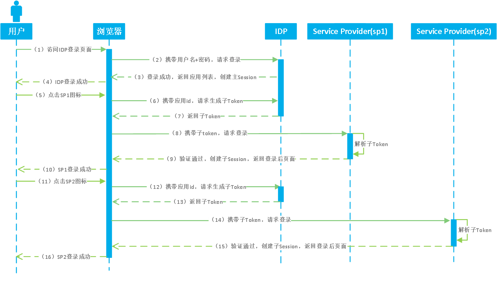
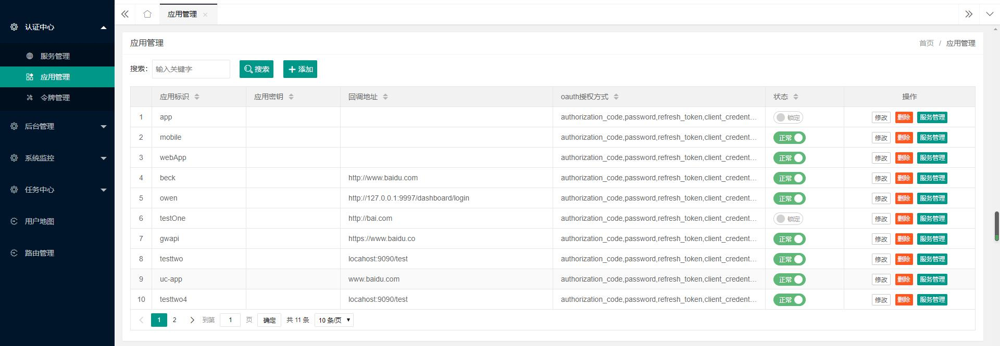
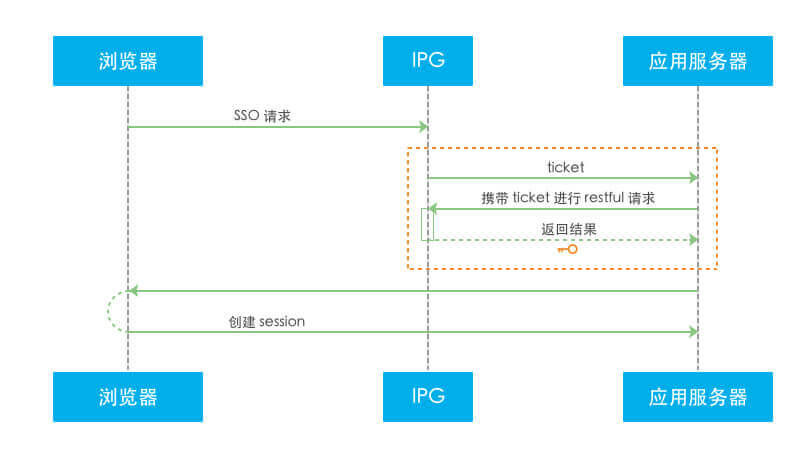
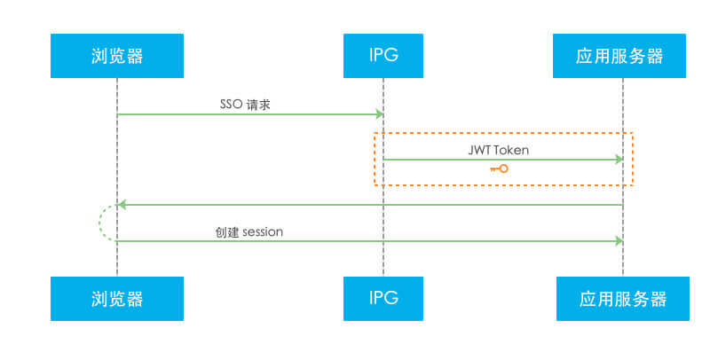

# 单点登录SSO-IDP发起
## 单点登录（SSO）概述
　　单点登录（SSO），英文全称为 Single Sign On。 SSO 是指在多个应用系统中，用户只需要登录一次，就可以访问所有相互信任的应用系统。Portal SSO 服务用于解决同一公司不同业务应用之间的身份认证问题，只需要登录一次，即可访问所有添加的应用。此服务可以涵盖用户在公有云和私有云中的双重需求。 
　　本文档默认你已经拥有了开发者权限，并已经阅读了 [准备开发](准备开发) 文档 和 [应用管理](应用管理) 文档。如果需要分配新的开发者权限的话，请联系 IT 管理员进行授权操作。

IDP发起 -> 单点登录示例

## 单点登录场景-IDP发起
在单点登录实现过程中，现已满足以下登录场景，包括：
1. [IDP发起](#IDP发起)

### IDP发起
即 Portal 发起。用户登录 Portal 平台，从 Portal 登录到 `SP` 应用场景，如下图所示：

Portal 发起单点登录流程

（1）用户访问 Portal 登录页面输入用户名和密码进行登录

（2）浏览器携带用户名密码向 Portal 请求登录

（3）Portal 认证通过后，创建主 session ，并返回应用列表给浏览器

（4）Portal 登录成功，用户可以看到 Portal 展示的应用列表

（5）用户点击应用列表中的 SP1 应用图标

（6）浏览器携带 SP1 应用的应用 id，向 Portal 请求生成 SP1 应用子 token

（7）Portal 根据信息生成子 token 并返回给浏览器

（8）浏览器携带子 token ，向 SP1 请求登录

（9）SP 1 应用系统解析获取的子 token ，验证通过后，创建子 session 并返回登录后页面

（10）SP 1 系统单点登录成功，浏览器显示 SP1 系统登录后页面

（11）\~（16）表示 SP2 系统的单点登录流程，与 SP1 系统步骤一致，即在主 session 创建后，任何一个可单点登录应用进行单点登录的流程只需重复（5）\~（10）即可

## 开发须知
### 开发者须知
`文档中的 “Portal-Base-URL” 需要替换为当前访问地址的主域，文中接口地址前也都需要替换主域地址；接口地址中的版本号以当前使用系统版本为准，也可以查看开发者文档中右侧菜单顶部的接口版本。`

用户通过登录 Portal 系统，能够在用户的主界面应用列表中看到自身有权限访问的应用列表。用户可以选择一个应用进行单点登录。

单点登录到第三方应用的过程，对于用户来说是透明过程。此过程无需用户填写第三方应用系统的账号信息，而是通过安全的协议交换令牌，直接验证身份进入应用系统。

公有云中的应用普遍支持 `OIDC` ， `OAuth` ， `SAML` 等标准协议。在私有云中，我们也提供了无插件式 SSO （如 CAS 标准和 CAS 改良）和插件式 SSO （如 JWT 标准协议）两种方式以方便企业内部应用向 Portal 的迁移。

业务应用集成到 Portal 后， Portal 会提供针对应用的一些接口，包括 账号关联，修改账户信息，解锁账户，删除账户等操作。针对用户或组织机构的操作接口，可以参考 [用户目录（UD）](开发指南/用户目录（UD）/用户目录（UD）同步概述.md) 文档。

通过 HTTPS 协议传输，理论支持任何一种开发语言

## 无插件式 SSO （access_token）
添加 access_token 应用

### 简介
整个无插件 access_token 的单点登录流程，就是需要开发者写一个页面接收 Portal 传过去的 url 参数，接着对 Portal 进行一次网络请求并验证返回值，成功则登录，失败则拒绝。开发人员可以自己按照这个逻辑完成代码，也可以在我们提供的代码 demo 的基础上进行修改。

### 实现原理

无插件式 SSO access_token 原理
 

1. 通过浏览器登录集成的 Portal 系统后，确认要单点登录的应用，发起 SSO 请求到 Portal 系统。

2. Portal 生成 `ticket` （传过来的url参数为code）指针发送到业务应用。

3. 业务应用获取到 ticket 后通过回调方法到 Portal 校验 `ticket` 。

4. Portal 获取到 `ticket` 后进行校验，返回校验结果给业务应用。

5. 如果校验结果成功，返回用户信息，应用在校验返回信息成功后登录；如果校验结果失败，你的应用应该拒绝登录。

<!-- ## 插件式 SSO（为SSO安全性考虑，Session可控，暂不开放此单点方式）
### 简介
整个插件式 JWT 的流程，是接收 Portal 平台向 callback url 发出的 id_token 参数（即 JWT 令牌），并使用我们提供的（或第三方提供的） JWT 解密库/方法对 JWT 进行解析，并验证身份。 你可以自己按照这个逻辑完成代码，也可以在我们提供的 代码/demo 的基础上进行修改。

### 实现原理

插件式 SSO - JWT 原理
 

1. 通过浏览器登录集成的 Portal 系统后，确认要单点登录的应用，发起 SSO 请求到 Portal 系统。

2. Portal 生成 `token` 令牌发送到业务应用。

3. 你的应用获取到 `token` 令牌，用我们提供的插件或方法解析 `token` 令牌，解析成功获取到用户信息并验证后，重定向进行登录；如果解析失败则拒绝登录。

### JAVA 插件式集成
#### 配置环境
JDK 1.8 以上
SDK 和对接示例可以通过 单点登录 相关下载 下载参考。 -->