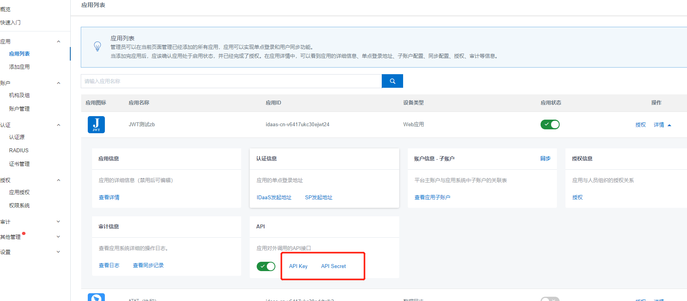

# SP（第三方应用）推数据至IDaaS
IDaaS提供一些UD同步的接口API（所有的API都是遵循SCIM协议的），SP通过调用这些API，可以将数据同步到IDaaS。SP在调用IDaaS接口时，必须传递access_token(具体使用方式请查看获取access_token)。以下，我们将常用的API按照 组织机构，账户，组进行分类。

## 前提条件：
### 1.获取IDaaS-Base-URL
文档中的“IDaaS-Base-URL”需要替换为当前访问地址的主域，文中接口地址前也都需要替换主域地址。主域为IDaaS控制台中的用户访问的Portal的sso地址。

### 2.获取client-id和client-secret
获取access_token时需要使用client-id和client-secret，我们可以在管理员控制台获取到。

在管理员控制台添加一个应用，在应用的详情中可以启动API,API的两个值对应client-id和client-secret.



## 接口列表
- 获取access_token

以下是关于组织机构操作的API，包括：

- 推送组织机构
- 修改或移动组织机构
- 删除组织机构
- 查询组织机构
- 获取组织机构列表
- 获取根节点组织机构信息
- 获取组织机构的直属子级

以下是关于账户操作的API，包括：

- 推送账户
- 修改或移动账户
- 删除账户
- 获取账户信息
- 查询账户列表

以下是关于组操作的API，包括：

- 推送账户组
- 更新账户组
- 删除账户组

其他：
- 获取应用已经授权的组织机构及账户列表

## 具体接口
### 获取access_token
调用以下API接口时，需要先获取access_token，调用接口时传入access_token有两种方式：
- URL值后：URL?access_token={access_token}
- Header里面：Authorization bearer {access_token}（注意 bearer与access_token之间的空格）

access_token分为两种类型：
- 以 /api/enduser 开头URL的API使用的access_token，代表的是一个用户登录后的access_token
- 以 /api/application 开头URL的API使用的access_token： 获取方式是向下面的URL进行POST请求，请求将返回json包含access_token：
	- `{IDaaS-Base-URL}/oauth/token?client_id={client-id}&client_secret={client-secret}&scope=read&grant_type=client_credentials` client_id和client_secret即为创建应用中的API Key和APi Secret
	- 开发者需要根据使用的API明确区分这2种Token，大部分UD功能使用的都是后一种返回的access_token。

### 推送组织机构
在SP中添加一个组织机构，调用此接口，将新添加的组织机构的信息同步到IDaaS。

**同步时，请按照层级关系进行同步，先同步父级再同步子级**

Request URI: /api/bff/v1.2/developer/scim/organization/create POST REST

Content-Type: application/json

Request Body：
```json
{
    "organizationName": "成都研发部",
    "externalId": "123456",
    "parentExternalId": "test3",
    "type": "DEPARTMENT",
    "sortNumber": "3",
    "enabled":true,
    "description": "负责产品研发",
    "extendFields":{
         "test1":"123"
    }
}
```

参数说明：

|参数名				|参数值				|类型	|长度				|备注																																				|
|--	|--	|--	|--	|--	|
|organizationName	|{organizationName}	|String	|>=1				|组织机构名称。必填																																	|
|externalId			|{externalId}		|String	|ou外部id(唯一)		|组织机构的唯一id,该id是SP同步过来的，所以在IDaaS中称为外部id,如果不填IDP讲随机生成一个外部id。选填													|
|parentExternalId	|{parentExternalId}	|String	|>=1				|所属的父级组织机构的唯一id, 该id是SP同步过来的, 所以在IDaaS中称为父级外部id，通过在系统”机构及组”中在组织机构属性中查看参数“外部ID”即可。必填	|
|type				|{type}				|String	|组织机构或部门		|自建组织单位：SELF_OU,自建部门：DEPARTMENT，默认为DEPARTMENT.选填																					|
|rootNode			|{rootNode}			|boolean|是否rootNode		|如果填true,将更新IDP中原本的根节点。选填																											|
|enabled			|{enabled}			|boolan	|账户状态			|true:启用，false:禁用，默认为true。选填																											|
|sortNumber			|{sortNumber}		|int	|机构排序号			|用于展示排序。选填																																	|
|description		|{description}		|String	|描述信息			|用于说明当前OU，不超过500个字符。选填																												|
|extendFields		|{extendFields}		|Map	|自定义扩展的字段	|在IDP数据字典中定义，如果自定义扩展的字段是必填选项，则该属性必填																					|

Response Body：
```json
{
"success": true,
"code": "200",
"message": null,
"requestId": "974CA7CA-1C98-4557-AC90-9425B2ED4719",
"data": {
    "externalId": "123456"
    }
}
```
succes代表请求是否成功，code为错误码 ，message为错误信息为接口。

success为true时，代表请求成功，此时code为200，data返回数据。请求失败时，success为false，code为一串语义化的错误码，如：InvalidParameter.ParentOUUuid.NotExist

错误码说明：

|HttpCode(请求状态码)	|code(错误码)						|message(错误信息)							|备注					|
|--	|--	|--	|--	|
|200					|200								|null										|请求成功				|
|400					|InvalidParameter					|例如：externalId:123456重复				|请求参数错误			|
|400					|InvalidParameter.ExternalId.Exist	|例如：外部ID重复，externalId：123456		|外部id重复				|
|400					|InvalidParameter.Name.Exist		|例如：OU名称重复，OrganizationName：研发部	|组织机构的名称已存在	|
|403					|Forbidden							|例如：没有权限操作该父OU					|没有权限操作			|

### 修改或移动组织机构
在SP中修改一个组织机构，调用此接口，将修改的组织机构的信息同步到IDaaS。

Request URI: /api/bff/v1.2/developer/scim/organization/update PUT REST

Content-Type: application/json

Request Body：
```json
{
    "description": "",
    "organizationName": "成都研发部",
    "externalId": "123456",
    "parentExternalId": "test3",
    "enabled":false,
    "type": null,
    "sortNumber": "5",
    "extendFields":{
       "test1":"1235123"
    }
}
```

参数说明：

|参数名				|参数值				|类型	|长度				|备注																																				|
|--	|--	|--	|--	|--	|
|externalId			|{externalId}		|String	|ou外部id(唯一)		|组织机构的唯一id,该id是SP同步过来的,在IDaaS中称为外部id。必填																						|
|organizationName	|{organizationName}	|String	|>=1				|组织机构名称。必填																																	|
|parentExternalId	|{parentExternalId}	|String	|>=1				|所属的父级组织机构的唯一id, 该id是SP同步过来的, 所以在IDaaS中称为父级外部id，通过在系统”机构及组”中在组织机构属性中查看参数“外部ID”即可。必填	|
|type				|{type}				|String	|组织机构或部门		|自建组织单位：SELF_OU,自建部门：DEPARTMENT。选填，填写则代表更新该项信息。																			|
|enabled			|{enabled}			|boolan	|账户状态			|true:启用，false:禁用。选填，填写则代表更新该项信息。																								|
|sortNumber			|{sortNumber}		|int	|机构排序号			|用于展示排序。选填，填写则代表更新该项信息。																										|
|description		|{description}		|String	|描述信息			|用于说明当前OU，不超过500个字符。选填，填写则代表更新该项信息。																					|
|extendFields		|{extendFields}		|Map	|自定义扩展的字段	|在IDaaS数据字典中定义，如果自定义扩展的字段是必填选项，则该属性必填																				|

Response Body：
```json
{
    "success": true,
    "code": "200",
    "message": null,
    "requestId": "C98418A3-63B5-49CA-9C85-A820A65D3247"
}
```

succes代表请求是否成功，code为错误码 ，message为错误信息为接口。

success为true时，代表请求成功，此时code为200，data返回数据。请求失败时，success为false，code为一串语义化的错误码，如：InvalidParameter.ParentOUUuid.NotExist

错误码说明：

|HttpCode(请求状态码)	|code(错误码)				|message(错误信息)							|备注					|
|--	|--	|--	|--	|
|200					|200						|null										|请求成功				|
|400					|InvalidParameter			|例如：描述信息不能超过500个字符			|请求参数错误			|
|400					|EntityNotFound				|例如：组织机构不存在						|未查找到要更新的OU		|
|400					|InvalidParameter.Name.Exist|例如：OU名称重复，OrganizationName：研发部	|组织机构的名称已存在	|
|400					|OperationDenied			|例如：OU不能移动到自己子级下				|不被允许的操作			|
|403					|Forbidden					|例如：没有权限操作该父OU					|没有权限操作			|

### 删除组织机构
在SP中删除一个组织机构，调用此接口，在IDaaS中也删除这个组织机构

Request URI: IDaaS提供API地址:/api/bff/v1.2/developer/scim/organization/delete DELETE REST

Content-Type: application/json

参数说明：

|参数名		|参数值			|备注												|
|--	|--	|--	|
|externalId	|{externalId}	|应用系统中组织机构的唯一标识，对应IDaaS中的外部id	|

请求示例：
```bash
/api/bff/v1.2/developer/scim/organization/delete?externalId=1694618271068407094
```

Response Body：
```json
{
    "success": true,
    "code": "200",
    "message": null,
    "requestId": "30A38CA4-D640-4CBA-B85F-A0234D0181F1"
}
```

succes代表请求是否成功，code为错误码 ，message为错误信息为接口。

success为true时，代表请求成功，此时code为200，data返回数据。请求失败时，success为false，code为一串语义化的错误码，如：InvalidParameter.ParentOUUuid.NotExist

错误码说明：

|HttpCode(请求状态码)	|code(错误码)						|message(错误信息)					|备注				|
|--	|--	|--	|--	|
|200					|200								|null								|请求成功			|
|400					|InvalidParameter					|例如：外部id(externalId)不能为空	|请求参数错误		|
|400					|EntityNotFound						|例如：组织机构不存在				|未查找到要更新的OU	|
|400					|OperationDenied.OUContainsChildren	|例如：该OU存在关联关系，不能删除	|未查找到要更新的OU	|
|403					|Forbidden							|例如：没有权限操作该父OU			|没有权限操作		|

### 查询组织机构
查询单个组织机构

Request URI: IDaaS提供API地址:/api/bff/v1.2/developer/scim/organization/detail  GET  REST

Content-Type: application/json

参数说明：

|参数名		|参数值			|备注												|
|--	|--	|--	|
|externalId	|{externalId}	|应用系统中组织机构的唯一标识，对应IDaaS中的外部id	|

请求示例：
```bash
/api/bff/v1.2/developer/scim/organization/detail?externalId=1694618271068407094
```

Response Body：
```json
{
    "success": true,
    "code": "200",
    "message": null,
    "requestId": "B5D4A6D1-9C51-4AC3-A413-4A27EE1C1474",
    "data": {
        "organizationName": "ceshi导入0009",
        "externalId": "9999",
        "parentExternalId": "764712910283009725",
        "type": "SELF_OU",
        "rootNode": false,
        "sortNumber": 0,
        "enabled": true,
        "description": null,
        "extendFields": {
            "4": "asd"
        }
    }
}
```

返回参数说明：

|参数名				|说明						|
|--	|--	|
|externalId			|组织机构的外部id			|
|organizationName	|组织机构名称				|
|externalId			|组织机构的外部id，和id一样	|
|parentExternalId	|父组织机构外部id			|
|type				|类型						|
|enabled			|账户是否可用				|
|description		|描述						|
|extendFields		|扩展字段					|

### 获取组织机构列表
SP通过调用此接口，可以查看所有的OU或者某OU及其所有子OU的组织机构列表。

Request URL: /api/bff/v1.2/developer/scim/organization/list  GET

Content-Type: application/json

参数说明：

|参数名	|参数值	|类型	|备注					|
|--	|--	|--	|--	|
|id		|{id}	|String	|组织单位的外部id。选填	|

- 如果不传值则返回该公司的所有组织机构
- 如果id不为空：则返回该OU下的组织机构的信息

请求示例：

获取该公司的所有组织机构：/api/bff/v1.2/developer/scim/organization/list

获取某个OU下所有组织机构的信息：/api/bff/v1.2/developer/scim/organization/list?id=5986176890912195413

Response Body：
```json
{
    "success": true,
    "code": "200",
    "message": null,
    "requestId": "3CCA4939-170C-46AA-BE11-F3DE924FC0E9",
    "data": {"organizations": [
            {
                "organizationName": "成都研发部",
                "externalId": "2858068028015036528",
                "parentExternalId": "129733886490329012",
                "type": "DEPARTMENT",
                "rootNode": false,
                "sortNumber": 0,
                "enabled": true,
                "description": "",
                "extendFields": {}
            },
            {
                "organizationName": "成都分公司",
                "externalId": "129733886490329012",
                "parentExternalId": "6721629573848908864",
                "type": "SELF_OU",
                "rootNode": false,
                "sortNumber": 0,
                "enabled": true,
                "description": "",
                "extendFields": {}
            },
            {
                "organizationName": "测试研发部3-3",
                "externalId": "test3-3",
                "parentExternalId": "test3",
                "type": "DEPARTMENT",
                "rootNode": false,
                "sortNumber": 3,
                "enabled": true,
                "description": "通过SCIM同步组织机构",
                "extendFields": {
                    "test1": "1235123"
                }
            },
            {
                "organizationName": "研发部3-4",
                "externalId": "test3-4",
                "parentExternalId": "test3",
                "type": "DEPARTMENT",
                "rootNode": false,
                "sortNumber": 3,
                "enabled": true,
                "description": "研发分部",
                "extendFields": {
                    "test1": "123"
                }
            }
            ]
    }
}
```

返回参数说明：

|参数名					|说明						|
|--	|--	|
|organizations			|返回的组织机构信息			|
|  ├ externalId		|组织机构的外部id			|
|  ├ organizationName	|组织机构名称				|
|  ├ externalId		|组织机构的外部id，和id一样	|
|  ├ parentExternalId	|父组织机构外部id			|
|  ├ type				|类型						|
|  ├ enabled			|账户是否可用				|
|  └ description		|描述						|
|  └ extendFields		|扩展字段					|

### 推送账户
SP中添加一个账户，调用此接口，将新添加的账户的信息同步到IDaaS中。

Request URI: /api/bff/v1.2/developer/scim/account/create   POST  REST

Content-Type: application/json

Request Body：
```json
{
    "externalId": "123456",
    "userName": "developer2",
    "displayName": "开发人员3",
    "password": "Jdev@12345",
    "email": "test2@test.com",
    "phoneNumber": "",
    "description": "",
    "belongs": [
        "test1","test2"
        ],
    "extendFields": {
        "test":"123456",
        "test1":"woman"
    }
}
```

参数说明：

|参数名			|参数值			|类型				|长度		|备注																		|是否必填																			|
|--	|--	|--	|--	|--	|--	|
|userName		|{userName}		|String				|>=4且<18	|云IDaaS平台主账户															|必填																				|
|password		|{password}		|String				|>=6		|云IDaaS平台主账户密码														|必填																				|
|displayName	|{displayName}	|String				|>2且<18	|用户的显示名称																|必填																				|
|externalId		|{externalId}	|String				|			|用户的唯一id																|选填。如果不填，将随机生成一个，并在结果中返回										|
|email			|{email}		|String				|			|邮箱																		|和手机号必有一个																	|
|phoneNumber	|{phoneNumber}	|String				|			|手机号, 只能一个且唯一														|和邮箱必有一个																		|
|belongs		|{belongs}		|String				|			|所属ou的外部id																|为OU外部id的集合，必填,具体看请求参数示例											|
|locked			|{locked}		|boolean			|			|账户是否锁定，ture:锁定账户,false:不锁定账户。锁定账户后将不能登录 IDaaS	|选填。填写则代表需要更新。															|
|enabled		|{enabled}		|boolean			|			|用户启用状态，ture启用,false禁用。禁用账户将不能登录 IDaaS					|非必填，不填默认启用账户															|
|description	|{description}	|String				|			|描述信息																	|选填																				|
|expireTime		|{expireTime}	|String				|			|过期时间。格式: yyyy-MM-dd,例如：2020-01-12								|选填																				|
|extendFields	|{extendFields}	|Map<String,String>	|			|自定义扩展的字段,在IDP数据字典中定义。										|选填，填写则代表更新该项信息。更新时，如果自定义扩展的字段是必填选项，则该属性必填	|

Response Body：
1. 失败示例：
```json
{
    "success": false,
    "code": "InvalidParameter",
    "message": "密码不符合密码策略 / 邮箱（email）: test@test.com 已经存在 / 所属组织机构(belongs):123456不存在",
    "requestId": "7BA02087-4789-4FA6-A414-45BAC671945E",
    "data": null
}
```
2. 成功示例
```json
{
    "success": true,
    "code": "200",
    "message": null,
    "requestId": "BF66FA08-E57B-4387-90C0-A72E41307239",
    "data": {
        "externalId": "123456"
    }
}
```

### 修改或移动账户
### 删除账户
### 获取账户信息
### 获取账户列表
### 推送账户组
### 更新账户组
### 删除账户组
### 获取用户已经授权的应用列表