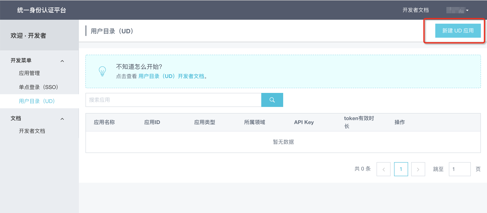
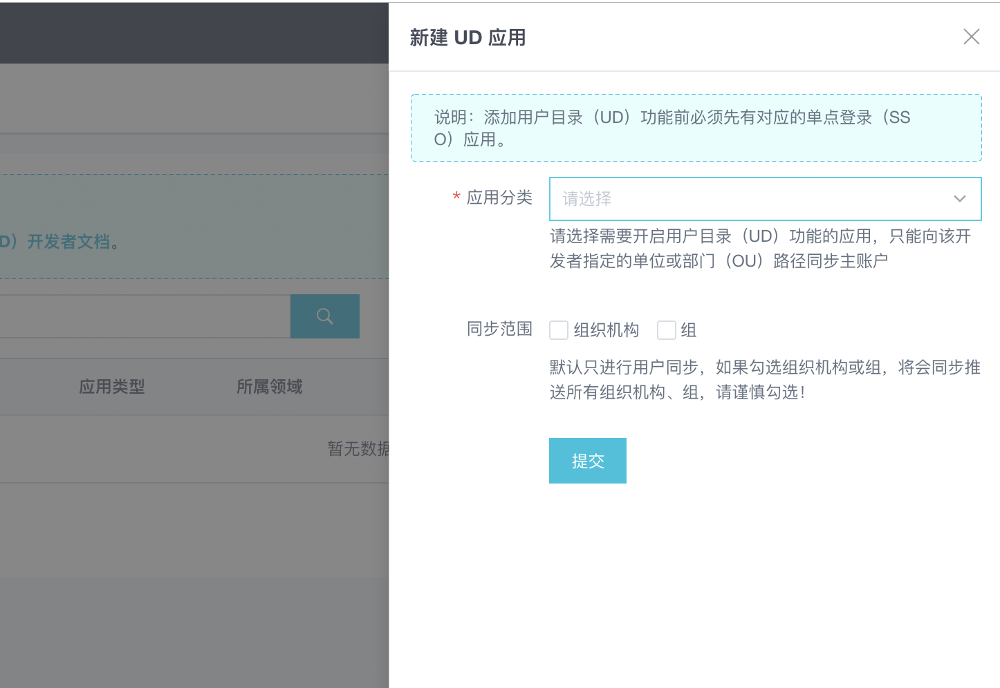
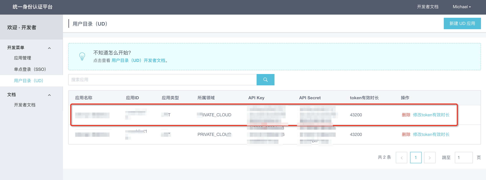
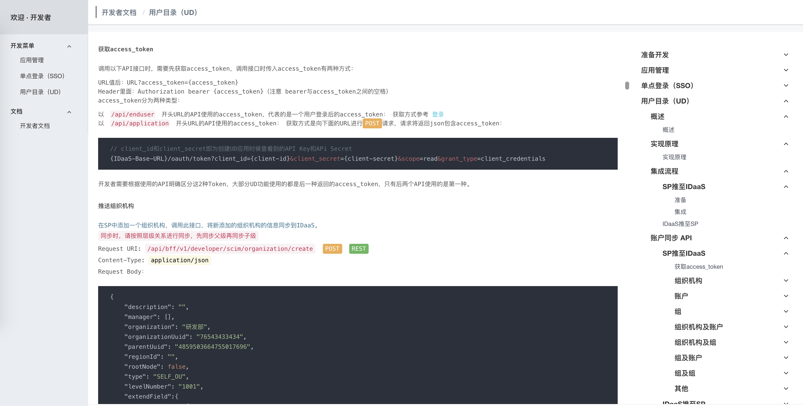
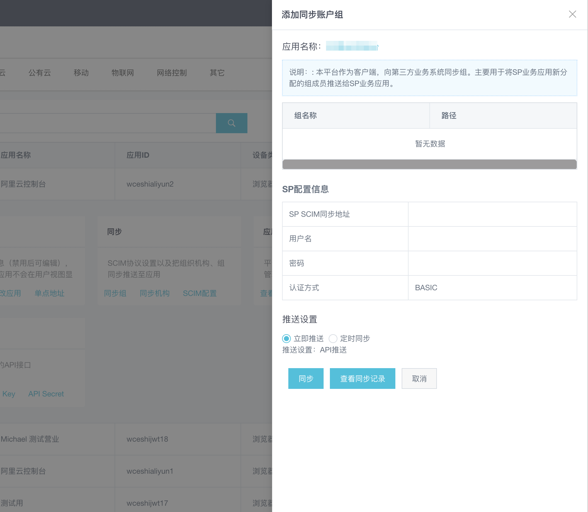

# 用户目录（UD）同步概述
## 用户目录（UD）概述
`UD` (User Directory)用户目录，它主要是集中管理公司的组织机构，组及账户，管理员通过设置IDaaS中的组织单位、组及账户，实现用户的统一身份管理。一个用户，一套账户密码，对账户进行统一管理，可以在功能上替代传统的AD 。其中的账户同步是我们提供给开发者一项重要的功能，在保证安全的前提下，可以保证账户数据的一致性，实时性。

本文档默认你已经拥有了开发者权限，并已经阅读了 `准备开发` 文档。如果需要分配新的开发者权限的话，请联系 IT 管理员进行授权操作。

## 实现原理
**账户同步：** 
IDaaS平台支持 SCIM 协议，账户同步机制支持两种方式：

1. 推的方式：IDaaS平台通过API将IDaaS中的账户信息同步到应用服务器（即SP Service Provider），需要业务系统提供API，如下图中第1步所示；

2. 送的方式：IDaaS系统提供API，应用服务器（即SP Service Provider）调用IDaaS平台API接口将业务账户信息同步到IDaaS中，如下图中第2步所示：

UD的推和拉
 

建议使用第一种方式； 
优势：在保证安全的前提下，可以保证账户数据的一致性，实时性； 
如果各业务系统（SP）采用第二种方式，IDaaS平台可提供相应技术文档及API接口；

## 集成流程
### SP推至IDaaS
#### 准备
本章节是应用服务器推向IDaaS（即方式2 送）的准备工作。本章节内容需要你已经创建至少一个单点登录SSO应用。如果需要创建无插件式CAS单点登录应用的话，请前往：无插件式SSO。如果要创建插件式JWT单点登录应用的话，请前往 插件式SSO。

如果你只想使用IDaaS推往应用服务器（即方式1 推）的接口的话请跳过，直接浏览下一章节 [IDaaS推数据到SP(第三方应用)](开发指南/用户目录（UD）/IDaaS推数据到SP（第三方应用）.md) 。

#### 添加账户同步
1. 申请完SSO应用后，点击左侧菜单中的用户目录（UD），来到用户同步页面，然后点击右上角-添加用户同步应用。

申请UD功能
 

2. 点击-请选择单点登录(SSO)应用,选择一个我们之前创建的单点登录应用，然后保存。

填写内容
 

3. 创建成功，可以直接获取到 Key 和 Secret。

添加UD功能完成
 

4. 在开发者文档中可以查看到如何使用 Key 和 Secret 获取 access_token，并使用 access_token 调用接口。

查看API Key和API Secret
 

#### 集成
集成
IDaaS提供了一系列接口，除了帮助你从你的应用服务器将用户同步到我们的IDaaS平台之外，还可以辅助你实现你自己的单点登录应用管理。

进行用户同步，首先要使用我们的 获取组织单位列表 接口，得到你可以添加到的组织单位列表。然后你需要从上至下，按组织单位到用户组到用户的顺序依次将所有的用户信息和组织结构推送至IDaaS。具体请查看我们的 [SP(第三方应用)推数据至IDaaS](开发指南/用户目录（UD）/SP(第三方应用)推数据至IDaaS.md) 。

### IDaaS推至SP
IDaaS推至SP的方式无须创建一个UD实例，只需要在IT管理员界面下为希望推送到的应用配置一些参数，即可实现从IDaaS推送内容到SP，而后SP需要在系统中按照我们给出的接口格式添加3个能接收数据的接口，解析并自行存储。

#### 为应用配置SCIM
1. 我们需要切换到IT管理员的角色，在左侧菜单中点击应用列表，在希望实现用户同步的应用右侧点开更多，并选择SCIM配置。如图所示：

为应用配置SCIM
 

2. 在SCIM配置界面我们可以为账户、账户组和组织单位设置他们的同步地址（即IDaaS向应用服务器SP发送数据的目标位置），请确保账户同步是开启的，并且选择Basic认证方式。你需要在你的系统中实现这几个接口的Basic认证方式，如下所示：

填写配置
 

3. 配置完成后，我们就可以尝试传输用户信息了，回来应用列表页，点开该应用详情，可以看到有同步相关的操作。如下所示：

进入子账户
 

4. 点击同步。这里会出现一个确认界面，确认无误后即可开始尝试推送，推送的结果会显示在页面的最下方：

确认同步信息
 

IDaaS 推至 SP 的下一步，就是在你的系统中集成接口用来接收用户、用户组和组织机构的信息了，请跳转到 [IDaaS推数据到SP(第三方应用)](开发指南/用户目录（UD）/IDaaS推数据到SP（第三方应用）.md) 查看接口格式。